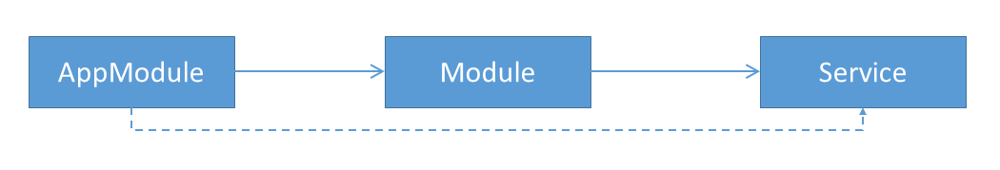
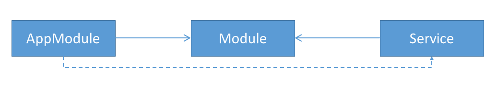

# Treeshakable Providers: Why, How and Cycles

**Source code:** https://github.com/manfredsteyer/treeshakable-providers-demo

Treeshakable providers are a new **optional** API that helps tools like webpack or rollup to get rid of unused services during the build process. Optional means that you can still go with the existing API you are used to. Besides smaller bundles, this innovation  also allows a more direct and easier way for declaring services. Also, it might be a first foretaste of a future where modules are optional.

In this post, I'm showing several options for using this new API and also point to some pitfalls one might run into. The [source code](https://github.com/manfredsteyer/treeshakable-providers-demo/tree/provideIn-module) I'm using here can be found in my [GitHub repository](https://github.com/manfredsteyer/treeshakable-providers-demo/tree/provideIn-module). Please note that each branch represents one of the below mentioned scenarios.

## Why and (a first) How?

First of all, let me explain why we need treeshakable providers. For this, let's have a look at the following example that uses the traditional API:

```typescript
@NgModule({
    [...]
    providers: [
        { provide: FlightService, useClass: FlightService }
        // Alternative: FlightService
    ]
    [...]
})
export class FlightBookingModule {
}
```

Let assume, our AppModule imports the displayed FlightBookingModule. In this case we have the following dependencies:



Here you can see, that the AppModule always indirectly references our service, regardless if it uses it or not. Hence, tree shaking tool decide against removing it from the bundle, even if it is not used at all.

To mitigate this issue, the core team found a solution that follows a simple idea: Turning around one of the arrows:



In this case, the AppModule just has a dependency to the service, when it uses it (directly or indirectly).

To express this in your code, just make use of the ``provideIn`` property within the ``Injectable`` decorator:

```typescript
@Injectable({ 
    providedIn: 'root' 
})
export class FlightService {
    constructor(private http: HttpClient) {}
    [...]
}
```

This property points to a module and the service will be put into this module's injection scope. The value ``'root'`` is just a shortcut for the root component's scope. Please note, that this scope is also used by all eagerly loaded (not lazy-loaded) modules. Only lazy loaded modules as well as components get there own scope which inherits from the root scope. For this reason, you will very like use ``'root'`` in most cases.

One nice thing about this API is that we don't have to modify the module anymore to register the service. This means that we can inject the service immediately after writing it.

## Indirections

The reason, we are using dependency injection is that it allows for configuring indirections between something that is requested (= the token) and the services injected. 

For this, you can use known properties like ``useClass`` within the Injectable decorator to point to the service to inject:

```typescript
@Injectable({ 
    providedIn: 'root',
    useClass: AdvancedFlightService,
    deps: [HttpClient]
})
export class FlightService {
    constructor(private http: HttpClient) {}
    [...]
}
```

This means that every component and service requesting a ``FlightService`` gets an ``AdvancedFlightService``. 

When I wrote this using version 6.0.0, I've noticed that we have to mention the dependencies to inject into the Service useClass points to in the ``deps`` array. Otherwise Angular uses the tokens from the current class' constructor. In the displayed example both expect an ``HttpClient``, hence the ``deps`` array would not be needed. I think that further versions will solve this issue so that we don't need the ``deps`` array for ``useClass``.

In addition to useClass, you can also use the other known options: ``useValue``, ``useFactory`` and ``useExisting``. Multi-Provider seem not to be supported by treeshakable providers which makes sense because a when it comes to this variety, the token should not know the individual services in advance. This means that we have to use the traditional API for this.

## Abstract Classes as Tokens

In the last example, we need to make sure that the ``AdvancedFlightService`` can replace the ``FlightService``. A super type like an abstract class or an interface would at least assure compatible signatures. 

If we go with an abstract class, we can also use it as a token. This is a common practice for dependency injection: We are requesting an abstraction and get one of the possible implementations injected. 

Please note, that we cannot use an interface as a token, even though this is usual in lot's of other environments. The reason for this is TypeScript that is removing interfaces during the compilation as JavaScript doesn't have such a concept. However, we need tokens at runtime to request a service and so we cannot go with interfaces. 

For this solution, we just need to move our ``Injectable`` decorator containing the DI configuration to our abstract class:

```typescript
@Injectable({ 
    providedIn: 'root',
    useClass: AdvancedFlightService,
    deps: [HttpClient]
})
export abstract class AbstractFlightService  {
    [...]
}
```

Than, the services can implement this abstract class:

```typescript
@Injectable()
export class AdvancedFlightService implements AbstractFlightService {
    [...]
}
```

Now, the consumers are capable of requesting the abstraction to get the configured implementation:

```typescript
@Component({ [...] })
export class FlightSearchComponent implements OnInit {

  constructor(private flightService: AbstractFlightService) { 
  }

  [...]
}
```

This looks easy, but here is a pitfall. If you closely look at this example, you will notice a cycle:

```
[AbstractFlightService] -- useClass --> [AbstractFlightService]
            ^                                     |
            +----------- implements ---------------
// TODO: real image
```

However, in this very case we are lucky, because we are ``implementing`` and not ``extending`` the abstract class. This lesser known feature allows us to use the abstract class like an interface: TypeScript just uses it to check the methods and the signatures. After this, it removes the reference to it and this resolves the cycle. 

But if we used extends here, the cycle would stay and this would result in an hen/egg-problem causing issues at runtime. To make a long story short: Always ``implements`` in such cases.

## Registering Services with Lazy Modules

In very seldom cases, you want to register a service with the scope of an lazy module. This leads to an own service instance (an "own singleton") for the lazy module that can override an service of an parent's scope.

For this, ``provideIn`` can point to the module in question:

```typescript
@Injectable({ 
    providedIn: FlightBookingModule,
    useClass: AdvancedFlightService,
    deps: [HttpClient]
})
export abstract class AbstractFlightService  {
}
```

This seems to be easy but it also causes a cycle:

```
[AdvancedFlightService] <--- [AbstractFlightService] <--- [LazyComponent]
        |                                                        ^
        +--------> [FlightBookingModule (lazy)] -----------------+

// TODO: add image
```

In a good discussion with [Alex Rickabaugh](https://github.com/alxhub) from the Angular team, I've found out that we can resolve this cycle be putting services in an own service module. I've called this module just containing services for the feature in question ``FlightApiModule``:

```
[AdvancedFlightService] <----- [AbstractFlightService] <----- [LazyComponent]
        |                                                            ^
        +---> [FlightApiModule] <--- [FlightBookingModule (lazy)] ---+

// TODO: add image
```

This means we just have to change ``providedIn`` to point to the new ``FlightApiModule``:

```typescript
@Injectable({ 
    providedIn: FlightApiModule,
    useClass: AdvancedFlightService,
    deps: [HttpClient]
})
export abstract class AbstractFlightService  {
}
```

In addition, the lazy module also needs to import the new service module:

```typescript
@NgModule({
    imports: [
        [...]
        FlightApiModule
    ],
    [...]
})
export class FlightBookingModule {
}
```

## Using InjectionTokens

In Angular, we can also use ``InjectionTokens`` objects to represent a tokens. This allows us to create tokens for situations a class is not suitable for. To make this variety treeshakable too, the InjectionTokens now takes an service provider: 


```typescript
export const FLIGHT_SERVICE = new InjectionToken<FlightService>('FLIGHT_SERVICE',
    { 
        providedIn: FlightApiModule, 
        factory: () => new FlightService(inject(HttpClient))
    }
);
```

For technical reasons, we have to specify a ``factory`` here. As there is not way to infer tokens from a function's signature, we have to use the shown ``inject`` method to get services by providing a token. Those services can be passed to the service the factory creates.

Unfortunately, we cannot use ``inject`` with tokens represented by abstract classes. Even though Angular supports this, ``inject``'s signature does currently (version 6.0.0) not allow for it. The reason might be that TypeScript doesn't have a nice way to express types that point to abstract classes. Hopefully this will be resolved in the future. For instance, Angular could use a workaround or just allow the type any for tokens. In the time being, we can just cast the abstract class to any as it is compatible with every type:

```typescript
export const BOOKING_SERVICE = new InjectionToken<BookingService>('BOOKING_SERVICE',
    { 
        providedIn: FlightApiModule, 
        factory: () => new BookingService(inject(<any>AbstractFlightService))
    }
);
```

## Using Modules to Configure a Module

Even though treeshakable providers come with a nicer API and help us to shrink our bundles, in some situations we have to go with the traditional ones. One such situation was already outlined above: Multi-Providers. Another case where we stick with the traditional API is when providing services to configure a module. An example for this is the ``RouterModule`` with its static ``forRoot`` and ``forChild`` methods taking a routing configuration. 

For this scenario we still need such static methods returning a ModuleWithProviders instance:

```typescript
@NgModule({
   imports: [ CommonModule ],
   declarations: [ DemoComponent ],
   providers: [ /* no services */ ],
   exports: [ DemoComponent ]
})
export class DemoModule { 
    static forRoot(config: ConfigService): ModuleWithProviders {
        return {
            ngModule: DemoModule,
            providers: [
               { provide: ConfigService, useValue: config }
            ]
        }
    }
}
```